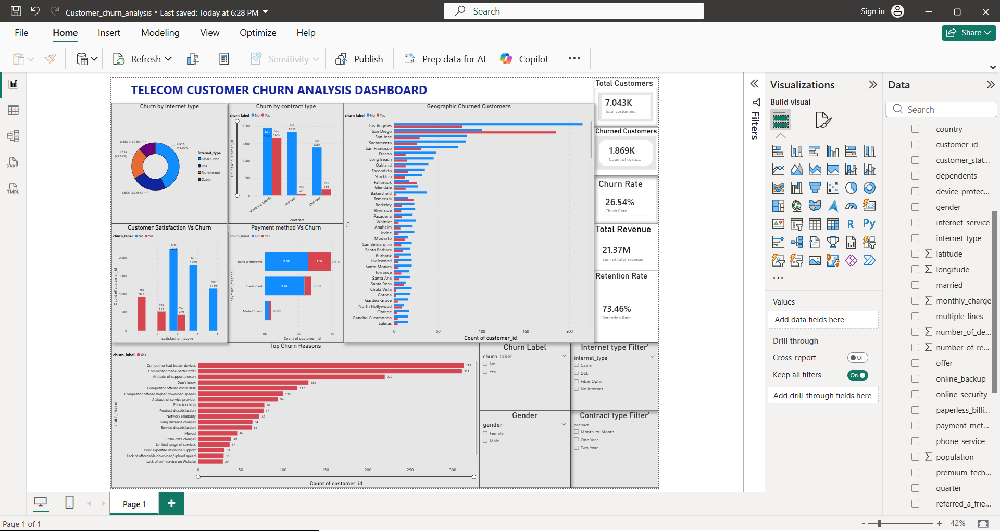

# Telecom-Customer-Churn-Analysis

**📌 Project Overview

This project focuses on analyzing customer churn behavior in a telecom company using Python, SQL, and Power BI.
The main objective of this project is to identify key factors responsible for customer churn and generate actionable business insights to improve customer retention strategies.

The project includes:

Data Cleaning & Preprocessing
Exploratory Data Analysis (EDA)
SQL-Based Business Analysis
Interactive Power BI Dashboard
KPI & Retention Analysis
Business Insights & Recommendations**

---------------------------------------

🎯 Business Objectives
Analyze customer churn patterns
Identify high-risk customer segments
Understand customer retention behavior
Perform revenue and satisfaction analysis
Generate business insights for decision-making
Build an interactive executive-level dashboard

-------------------------------------------

🛠️ Technologies Used
Technology	    Purpose
Python     	Data Cleaning & EDA
Pandas    	Data Manipulation
NumPy     	Numerical Operations
Matplotlib 	Data Visualization
Seaborn   	Statistical Visualization
SQL       	Business Query Analysis
Power BI	  Dashboard & Reporting
DAX	        KPI Calculations

---------------------------------------

📂 Project Structure

Customer-Churn-Analysis/
│
├── data/
│   ├── customer_churn.csv
│   └── cleaned_customer_churn.csv
│
├── python_analysis/
│   └── churn_analysis.py
│
├── sql_queries/
│   └── churn_analysis_queries.sql
│
├── powerbi_dashboard/
│   └── Customer_Churn_Analysis.pbix
│
├── screenshots/
│   └── dashboard.png
│
└── README.md

----------------------------------------------

🔍 Project Workflow
1️⃣ Data Cleaning & Preprocessing

Performed using Python:

Removed duplicate records
Handled missing values
Standardized column names
Data validation and formatting
Exported cleaned dataset for analysis
Python Libraries Used
----pandas
numpy
matplotlib
seaborn----

-----------------------------------------

2️⃣ Exploratory Data Analysis (EDA)

Performed detailed analysis on:

Customer churn distribution
Contract type analysis
Internet service analysis
Payment method analysis
Customer satisfaction analysis
Revenue analysis
Geographic churn analysis

----------------------------------------

3️⃣ SQL Business Analysis

SQL queries were used for:

Churn rate calculation
Retention analysis
Revenue KPIs
Customer segmentation
Contract analysis
Advanced filtering and aggregation
SQL Concepts Used
GROUP BY
HAVING
ORDER BY
Aggregate Functions
CASE Statements
CTEs
Window Functions

-------------------------------------------

4️⃣ Power BI Dashboard

An interactive Power BI dashboard was developed with:

KPI Cards
Churn Rate Analysis
Retention Rate Analysis
Revenue KPIs
Contract Type Analysis
Payment Method Analysis
Geographic Customer Analysis
Customer Satisfaction Analysis
Top Churn Reasons
Interactive Slicers & Filters

--------------------------------------------

📈 Key Business Insights
🔴 High Churn in Month-to-Month Contracts

Customers with month-to-month contracts showed significantly higher churn compared to long-term contract customers.

🔴 Competitor Offers as Major Churn Driver

One of the major reasons for churn was better offers provided by competitors.

🔴 Low Satisfaction Increases Churn Risk

Customers with lower satisfaction scores had a higher tendency to churn.

🔴 Payment Method Impacts Retention

Electronic check payment users showed relatively higher churn behavior.

🔴 Long-Term Customers Show Better Retention

Customers with yearly contracts demonstrated stronger customer loyalty.

---------------------------------------------

📸 Dashboard Preview
Telecom Customer Churn Dashboard

-------------------------------------------

💡 Business Recommendations
Promote long-term contracts to improve customer retention
Provide loyalty offers for high-risk customers
Improve customer support quality
Enhance pricing transparency
Improve service quality in high churn regions
Encourage automatic payment methods

---------------------------------------

🚀 Future Enhancements
Machine Learning-based churn prediction
Customer risk scoring system
Real-time dashboard integration
Streamlit web application deployment
Automated reporting pipeline

------------------------------------

🎓 Learning Outcomes

Through this project, I gained practical experience in:

Data Cleaning & Preprocessing
Exploratory Data Analysis
SQL Query Optimization
KPI Development
Power BI Dashboard Design
Business Intelligence & Reporting
Data Storytelling & Visualization

------------------------------------

👩‍💻 Author
Soumya Singh
Skills Demonstrated
Python
SQL
Power BI
Data Analysis
Dashboard Development
Business Intelligence
Data Visualization
